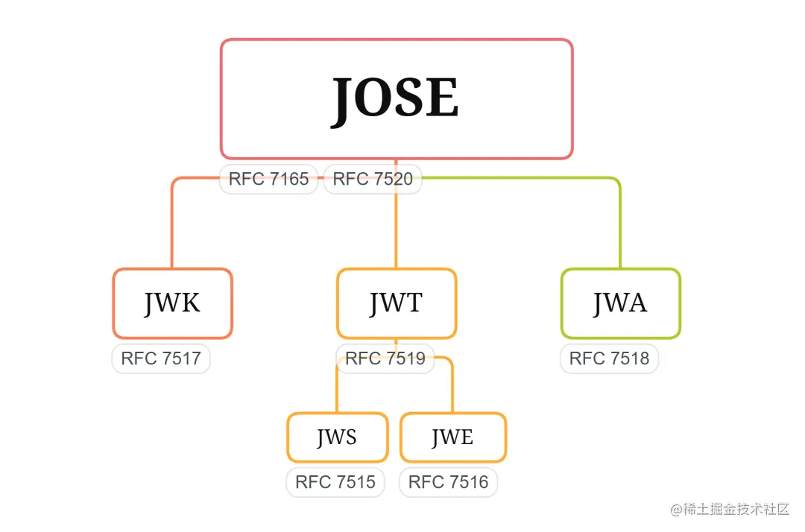

## 前言

Json Web Token（JWT）包含两种实现：Json Web Signature（JWS）和Json Web Encryption（JWE）。通常提到JWT时指的其实是它的JWS实现，这里我们讨论一下JWE。什么是JWE？如 RFC 7516 中定义，JSON Web 加密 (JWE) 是一种以 JSON 格式加密和解密数据的机制。

这里借用一张图说明一下JWT、JWS、JWE三者的关系。




## 安全风险提示

本文章中的内容与源代码仅供学习交流使用，请勿在生产环境直接使用。


## JWE 的格式是什么？

JWE 有两种序列化格式：紧凑和 JSON。每种格式都有其表示加密数据的方式。

### 紧凑序列化

在紧凑序列化中，JWE 被表示为一个包含五个 Base64URL 编码部分的字符串，这些部分之间用点（`.`）分隔。这五个部分是：

```
{{header}}.{{encrypted-key}}.{{iv}}.{{ciphertext}}.{{tag}}
```

每个部分的用途如下：

- `header`：包含有关加密算法和密钥管理的元数据。
- `encrypted-key`：用于加密有效载荷（payload）的加密内容加密密钥 (CEK)。
- `iv`：加密过程中使用的初始化向量。
- `ciphertext`：加密的有效载荷（payload）数据。
- `tag`：用于验证加密数据完整性的认证标签。

### JSON 序列化

JSON 序列化更为详细，并提供了一种结构化的方式来表示 JWE。JWE 表示为一个包含以下属性的 JSON 对象：

```
{
  "protected": "{{protected-header}}",
  "unprotected": "{{unprotected-header}}",
  "header": "{{header}}",
  "encrypted_key": "{{encrypted-key}}",
  "iv": "{{iv}}",
  "ciphertext": "{{ciphertext}}",
  "tag": "{{tag}}",
  "aad": "{{additional-authenticated-data}}"
}
```

- `protected`：包含 Base64URL 编码的受保护头。
- `unprotected`：包含 JWE 共享未受保护头。
- `header`：包含 JWE 每个接收者的未受保护头。
- `encrypted_key`：包含 Base64URL 编码的加密内容加密密钥 (CEK)。
- `iv`：包含 Base64URL 编码的初始化向量。
- `ciphertext`：包含 Base64URL 编码的密文（加密的有效载荷（payload））。
- `tag`：包含 Base64URL 编码的认证标签。
- `aad`：包含 Base64URL 编码的附加认证数据。


## 一个JWE的Demo

我使用go-jose/v4实现一个生成JWE用于认证，并且验证JWE的demo。这里，我使用的非对称密钥对是ECDSA（椭圆曲线数字签名算法）密钥对，曲线为P-256；对称加密算法为A256GCM。

```go
package utils

import (
	"crypto/ecdsa"
	"crypto/elliptic"
	"crypto/rand"
	"encoding/json"
	"time"

	"github.com/go-jose/go-jose/v4"
)

var (
	JWE_PRIVATE_KEY *ecdsa.PrivateKey
)

func init() {
	JWE_PRIVATE_KEY = GenerateJWEPrivateKey()
}

type TokenPayload struct {
	Nbf time.Time `json:"nbf" binding:"required"`
	Id  uint      `json:"id" binding:"required"`
	Exp time.Time `json:"exp" binding:"required"`
}

func GenerateJWEPrivateKey() *ecdsa.PrivateKey {
	jweKey, err := ecdsa.GenerateKey(elliptic.P256(), rand.Reader)
	if err != nil {
		panic(err)
	}
	return jweKey
}

func GenerateJWEToken(payload TokenPayload) (string, error) {

	claims, err := json.Marshal(payload)
	if err != nil {
		println("error")
		return "", err
	}

	encrypter, err := jose.NewEncrypter(jose.A256GCM, jose.Recipient{Algorithm: jose.ECDH_ES_A256KW, Key: &JWE_PRIVATE_KEY.PublicKey}, nil)
	if err != nil {
		return "", err
	}

	jweObj, err := encrypter.Encrypt(claims)
	if err != nil {
		return "", err
	}

	jweToken, err := jweObj.CompactSerialize()

	if err != nil {
		return "", err
	}

	return jweToken, nil
}

func VerifyJWEToken(token string) (TokenPayload, error) {

	jweObj, err := jose.ParseEncryptedCompact(token, []jose.KeyAlgorithm{jose.ECDH_ES_A256KW}, []jose.ContentEncryption{jose.A256GCM})
	if err != nil {
		return TokenPayload{}, err
	}

	claims, err := jweObj.Decrypt(JWE_PRIVATE_KEY)
	if err != nil {
		return TokenPayload{}, err
	}

	var payload TokenPayload
	err = json.Unmarshal(claims, &payload)
	if err != nil {
		return TokenPayload{}, err
	}

	return payload, nil
}
```

可以将这个包加入你的go项目，调用`utils.GenerateJWEToken`，传入TokenPayload类型的变量，生成JWE；调用`utils.VerifyJWEToken` 传入JWE，还原TokenPayload。TokenPayload的值可以根据实际需要自行修改，JWE_PRIVATE_KEY可以根据实际需要更换为固定值，或者从配置文件中加载，这里不再赘述。


## JWE和JWS在认证过程如何结合使用？

虽然没这个必要，但是结合使用JWE 和 JWS 可以确保JWS在传输过程中，不会在无法被发现的情况下被篡改。

首先，对要保护的数据（如用户信息或声明）进行签名，生成 JWS。

- 创建一个 JSON 对象，包含要传输的数据。
- 使用密钥对该 JSON 对象进行签名，生成 JWS。

JWS 的结构通常是：`header.payload.signature`。

接下来，将生成的 JWS 作为载荷（payload）进行加密，生成 JWE。

- 选择加密算法和密钥。
- 使用 JWE 的加密算法对 JWS 进行加密，生成 JWE。

JWE 的结构通常是：`header.encrypted_key.iv.ciphertext.tag`。

先签名再加密的原因在于，签名可以确保数据在传输过程中未被篡改，接收者能够验证其来源和完整性；如果先加密，接收者在解密之前无法访问原始数据，无法进行签名或验证，从而无法保证数据的来源和完整性。


## 参考文献 

[JSON Web 加密 (JSON Web Encryption, JWE) ](https://auth-wiki.logto.io/zh/jwe)

[干货 | 一些 JWT 不为人知的秘密](https://juejin.cn/post/7063135773771431943)

[Go JOSE](https://pkg.go.dev/github.com/go-jose/go-jose/v4)