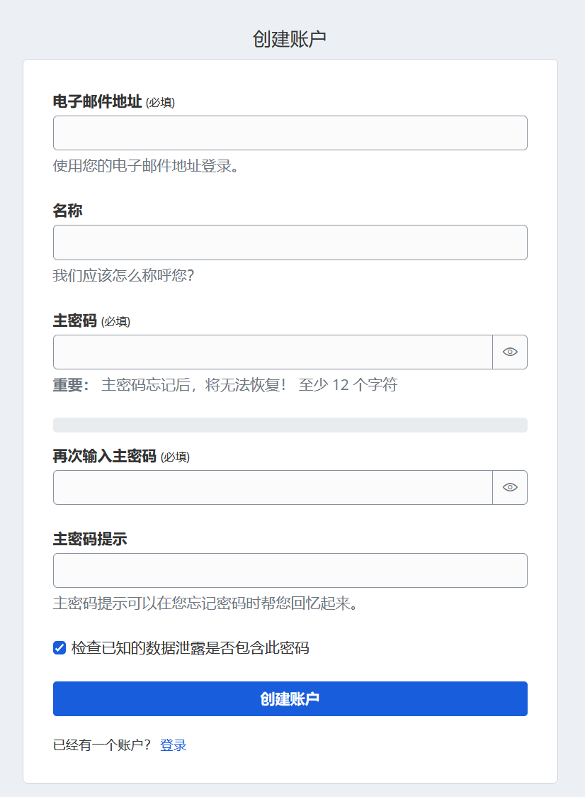

## 安全风险提示

本文章中的内容与源代码仅供学习交流，请勿在生产环境直接使用。

## 1 引言

互联网时代以来，人们拥有的网络账户数量急剧增加，如何管理大量账户的密码成为一个痛点。本文面向有一定linux操作系统使用经验的个人用户编写，介绍密码管理器与vaultwarden，并给出一个私有化部署与使用vaultwarden的示例，旨在帮助读者更好的使用Bitwarden/vaultwarden在多平台上安全且方便的管理大量个人账户的密码。

## 2 密码管理器、Bitwarden与vaultwarden简介

### 2.1 什么是密码管理器？为什么需要密码管理器？

密码管理器是一种工具，用于创建、存储和管理密码及其他相关数据。使用密码管理器的人只需记住一个主密码，就可以安全地访问其他所有密码。

**减少密码疲劳**

普通人通常拥有大约100个在线账户，包括财务、社交媒体、工作和学校账户。这意味着他们需要记住100多个不同的密码。这种情况常常导致人们在多个账户中使用相同的密码或其变体，从而增加了账户被盗的风险。密码管理器可以为每个在线账户生成独特且强大的密码，并将其安全地存储在加密的库中。用户只需记住主密码，就能访问所有的登录凭证和其他敏感信息。

**帮助生成唯一的强密码**

密码管理器通常配备有内置的密码生成器，可以立即创建独特且强大的密码。通过使用密码管理器的自动填充功能，用户不必自己创建密码，就能为账户生成安全的密码。这确保了每个账户都使用强密码进行保护，降低了被网络犯罪分子攻击的风险。

**问题：如果密码管理器的库文件泄露，我的密码会被泄露吗？**

这主要取决于主密码的强度。大多数密码管理器会对存储的密码进行强加密，即使文件被泄露，攻击者在不知道主密码的情况下也很难解密得到你的密码。然而如果这个主密码强度不足，攻击者可能会通过暴力破解或其他手段获取到你的密码。

### 2.2 为什么更推荐Bitwarden？

这里从以下方面比较1password与keepass两款竞品。它们都很优秀，但是我更推荐Bitwarden。

**支持多平台同步**

Bitwarden支持多种平台，包括Windows、macOS、Linux、Android和iOS，用户可以在不同设备间无缝同步密码。此外，它还提供浏览器扩展，支持主流浏览器，方便用户在日常使用中快速填写密码。

1Password的多平台支持能力与Bitwarden相同。Keepass官方只提供多windows端同步功能，且基于云盘等文件同步服务，需要自行搭建FTP或webdav服务器，相对繁琐。

**开源的解决方案**

Bitwarden是一个开源密码管理器，这意味着其源代码公开，用户和开发者可以审查和贡献代码。这种透明性增加了安全性，用户可以更放心地使用，了解其背后的技术架构。

Keepass也是开源的，但Keepass官方只提供windows客户端，其他平台上的多个开源版本分别由不同的社区成员提供。1password是闭源商业解决方案。

**支持私有化部署**

Bitwarden可以私有化部署，允许用户将密码管理器托管在自己的服务器上。这对那些对数据隐私有严格要求的用户来说，提供了更高的安全性和控制权。

1Password不支持私有化部署，用户只能使用其云服务。keepass不提供服务端程序，在没有同步需求的情况下不需要部署，但需要同步的用户需要自行部署FTP或webdav服务器。

**经济实惠**

为个人和家庭部署私有化bitwarden（这里特指vaultwarden实现）仅需要租用1vCPU、1G RAM的云服务器，或相同规格的docker镜像托管服务，约40-60人民币每月。用户可以以低廉的价格享受更多高级功能，这使得Bitwarden成为个人用户和小型团队的理想选择。

1password每人每月的云服务费用是4美元，如果年付，平均每人每月是3美元；在用户数量超过2人时，价格比自行部署bitwarden更昂贵。Keepass虽然是免费的，但缺乏一些现代化的用户体验和功能。

### 2.3 什么是vaultwarden？

Bitwarden官方也提供用于私有化部署的服务端程序，但是对云服务器的性能需求相对较高。[vaultwarden](https://github.com/dani-garcia/vaultwarden)是bitwarden服务端的一个非官方开源替代项目，使用rust编写，占用服务器资源极少，与bitwarden的多种客户端可以完美对接。

这里引用vaultwarden项目的自我描述：

>An alternative server implementation of the Bitwarden Client API, written in Rust and compatible with [official Bitwarden clients](https://bitwarden.com/download/) [[disclaimer](https://github.com/dani-garcia/vaultwarden#disclaimer)], perfect for self-hosted deployment where running the official resource-heavy service might not be ideal.

## 3 私有化部署vaultwarden

下文介绍如何在linux服务器上私有化部署vaultwarden，通过Caddy暴露到公网并自动维护https证书。

### 3.1 私有化部署的准备工作

请确保你已经做了如下准备：

- 拥有一个装有linux系统的云服务器（如ubuntu 22.04 LTS）。

- 拥有一个指向该服务器的域名（如果服务器在中国大陆，域名需要进行ICP备案）。

- 在服务器上安装了docker compose，请参考docker官网。

- 在服务器上安装了安装caddy，请参考[caddy下载页面](https://caddyserver.com/download)或使用包管理器安装。也可以使用nginx代替。

- 已掌握linux中编辑文本文件的方法（例如vim）。

### 3.2 生成管理员密码哈希

vaultwarden的管理面板需要用管理员密码访问，因此需要在环境变量里配置`ADMIN_TOKEN`。出于安全性考虑，应当使用 Argon2 对 `ADMIN_TOKEN` 进行哈希处理，生成一个 [PHC 字符串](https://github.com/P-H-C/phc-string-format/blob/master/phc-sf-spec.md)。可以使用 `argon2` CLI 工具生成该字符串，该工具在大多数 Linux 发行版上均可用。

假设你的管理员密码是`MySecretPassword`，在linux终端中输入：

```bash
# Using the Bitwarden defaults
echo -n "MySecretPassword" | argon2 "$(openssl rand -base64 32)" -e -id -k 65540 -t 3 -p 4
```

会得到密码的哈希

```bash
# Output: $argon2id$v=19$m=65540,t=3,p=4$bXBGMENBZUVzT3VUSFErTzQzK25Jck1BN2Z0amFuWjdSdVlIQVZqYzAzYz0$T9m73OdD2mz9+aJKLuOAdbvoARdaKxtOZ+jZcSL9/N0
```

后文配置环境变量时会用到这个哈希值。

应当在启用此功能时（之前）激活 HTTPS，以避免可能的中间人攻击（MITM）。HTTPS的设置请参考后文。

### 3.3 使用docker compose部署vaultwarden

要使用 Docker Compose，你需要在想部署的目录下创建一个 `docker-compose.yaml` 文件，该文件将包含运行 Vaultwarden 容器的配置。

可以在`/opt/vaultwarden`或任何你喜欢的目录下部署vaultwarden。

```yaml
services:
  vaultwarden:
    image: vaultwarden/server:latest
    container_name: vaultwarden
    restart: unless-stopped
    environment:
      DOMAIN: "https://vaultwarden.example.com"
      ADMIN_TOKEN: ${VAULTWARDEN_ADMIN_TOKEN}
    volumes:
      - ./vw-data/:/data/
    ports:
      - 127.0.0.1:8080:80
```

### 3.4 使用.env文件配置环境变量文件

在 `docker-compose.yaml` 文件相同目录下创建 `.env` 文件并输入以下内容：

```
VAULTWARDEN_ADMIN_TOKEN='$argon2id$v=19$m=65540,t=3,p=4$MmeK.....'
```

确保在 Docker Compose 使用的 `.env` 文件中使用单引号包围管理员密码的哈希。

**问题：为什么不直接在`docker-compose.yaml`中配置ADMIN_TOKEN？**

docker compose中的美元符号和argon2生成的hash中的美元符号会混淆，如果一定要在docker compose配置文件中添加，需要替换所有的$为$$，否则docker compose无法正常识别环境变量。

### 3.5 配置caddy

Caddy是一个web服务器，功能与nginx类似，但是比nginx更轻量化。此外，Caddy提供自动https功能。有关Caddy的更多信息，请参考[Caddy官网](https://caddyserver.com/)。

编辑`/etc/caddy/Caddyfile`，加入以下内容：

```
vaultwarden.example.com:443 {
	reverse_proxy 127.0.0.1:8080
}
```

其中`example.com`应替换为你自己的域名。如果你在docker compose文件中修改了宿主机端口，应该在这里也修改以保持一致。

保存文件后，在终端中输入以下指令来重启caddy服务：

```bash
systemctl restart caddy
```

如果域名的dns记录指向该服务器，且vaultwarden服务端运行正常，caddy会自动申请Let‘s Encrypt的免费https证书并定期更新，你不需要进行其他操作。

### 3.6 启动vaultwarden

在linux中，切换到在包含与的部署目录下，然后输入：

```bash
docker compose up -d
```

来启动vaultwarden。

可以通过指令`docker compose logs vaultwarden`来查看日志。

需要注意的是，如果你的服务器在中国大陆，你可能无法正常下载docker镜像。你可以在本地电脑上下载镜像后，通过导出镜像文件，并上传到服务器，在服务器中导入镜像。

下载镜像：
```powershell
docker pull vaultwarden/server:latest
```

导出镜像：

```powershell
docker save -o vaultwarden.tar vaultwarden/server:latest
```

上传到服务器：

```powershell
scp vaultwarden.tar user@192.168.1.100:/opt/vaultwarden
```

导入镜像：

```bash
docker load -i /opt/vaultwarden/vaultwarden.tar
```

查看本地存在的镜像列表：

```bash
docker images
```

## 4 使用Bitwarden/vaultwarden

如前文所述，Bitwarden是一套开源的解决方案，包含服务端，网页应用、浏览器插件、安卓客户端以及其他客户端，vaultwarden是Bitwarden服务端的开源实现。下文中提到vaultwarden时，特指自己部署的vaultwarden服务端。

### 4.1 注册账户

打开你的vaultwarden网页（上文中为“https://vaultwarden.example.com”），点击创建账户，进入注册页面。


输入相关信息后点击按钮创建账户即可。**请注意：主密码必须牢记！！！**如果你忘了你的主密码，你的密码库将永远无法解锁。



### 4.2 浏览器插件配置

**安装**

首先，你需要在浏览器中安装Bitwarden的插件。可以通过访问浏览器的扩展商店，搜索“Bitwarden”并点击“添加到浏览器”进行安装。安装完成后，插件图标将出现在浏览器工具栏中。


**登录到服务器**

打开浏览器插件，选择登录到“自托管”


输入你的服务器地址（示例中为https://vaultwarden.example.com）


点击保存，返回到登录页面，输入Bitwarden账户密码进行登录。

**设置PIN**

为了方便起见，可以在自己的设备上为插件设置一个PIN码。进入插件的设置选项，找到“账户安全”部分，选择“使用PIN码解锁”


按照提示输入你的PIN码。这样，访问插件时可以减少输入主密码的次数。


### 4.3 安卓客户端配置

**安装**

在手机应用商店中搜索“Bitwarden”并下载应用，或者从[GitHub页面](https://github.com/bitwarden/android)下载应用。安装完成后，打开应用。

**登录到服务器**

在应用中输入自托管服务器地址与账户密码即可登录，与浏览器插件登录类似，这里不再赘述。

**设置为默认自动填充**

在手机设置中，找到“自动填充服务”选项，将Bitwarden设置为默认的自动填充应用。


这样，在输入用户名和密码时，Bitwarden可以自动提供建议。

**开启生物识别**

为了方便和安全，建议开启生物识别功能。在应用中的设置选项，找到“账户安全”部分，选择“使用生物识别解锁”，验证指纹或人脸后即可开启。这样，打开安卓bitwarden应用时，可以通过指纹或人脸解锁，而无需每次都输入主密码。

### 4.4 导入其他来源的密码

如果你之前使用过其他密码管理器，可以轻松地将密码导入到vaultwarden中。首先，导出你旧密码管理器中的密码数据，通常为CSV或JSON格式。然后，在vaultwarden的网页端，找到“导入”选项，选择相应的文件格式并上传文件，系统将自动将密码导入到你的账户中。

如果你之前没有使用过密码管理器，可以先在vaultwarden中添加一个密码，然后以csv格式导出，这样，你可以手动编辑csv文件，添加你的密码，然后导入到vaultwarden中。

### 4.5 使用Send共享密码

Send功能允许用户安全地共享密码或敏感信息。要使用此功能，首先在vaultwarden网页端或Bitwarden应用中选择“Send”选项，输入你想要共享的信息。你可以设置有效期和访问权限，生成一个唯一的共享链接。将该链接发送给需要的人，他们可以通过链接安全地访问你共享的信息，而无需创建账户。

## 5 管理与维护vaultwarden

可以通过管理员面板来管理vaultwarden。本文示例中，管理员面板的地址为：https://vaultwarden.example.com/admin，实际使用请替换为你的vaultwarden的网址。

### 5.1 开启、关闭注册功能

展开General Settings选项卡，调整Allow new Signups来开启或关闭注册功能。


个人或家庭使用时，建议关闭注册功能。

### 5.2 配置SMTP发信

vaultwarden在某些场景下会向用户发送电子邮件，出于安全考虑，建议配置SMTP发信功能。个人使用可以添加自己的个人邮箱来发信。

展开SMTP Email Settings选项卡，根据自己的邮箱SMTP配置指南进行配置。

- Host填写邮箱服务商的SMTP服务器地址
- Secure SMTP为默认值starttls，如果无法使用，尝试改为force_tls
- Post根据邮件服务商的指南，应当为465或者587。不要使用25，这不安全，而且云服务商极少开放25端口
- From Address与Username均填写电子邮箱地址
- Password填写授权码，如果邮件服务商不提供授权码，填写邮箱密码


点击下方的按钮发送测试电子邮件，以确认你的SMTP配置是正确的。


### 5.3 手动备份vaultwarden数据

建议定期备份vaultwarden数据。本文中部署的vaultwarden使用sqlite数据库，因此只需要打包整个部署目录即可备份。

首先，通过包管理器安装 `zip`。例如，在 Ubuntu 上，可以使用以下命令：

```bash
sudo apt update
sudo apt install zip
```

然后，输入以下指令来打包压缩部署目录并加密

```bash
zip -r -e vaultwarden.zip /opt/vaultwarden
```

在执行命令后，系统会提示你输入密码并确认密码

需要恢复时，输入以下指令：

```bash
unzip -l vaultwarden.zip
```

系统会要求你输入密码。


## 参考文献 

[What Is a Password Manager?](https://www.keepersecurity.com/blog/2024/07/11/what-is-a-password-manager-2/index.html)

[Bitwarden](https://bitwarden.com)

[vaultwarden](https://github.com/dani-garcia/vaultwarden)

[Caddy](https://caddyserver.com/)

[Vaultwarden Wiki 中文版](https://rs.ppgg.in/home)