**关键词**： 我的世界 Minecraft  服务器 1.16 国际版

## 前言

我是一个老MC划水员，为了和好朋友远程联机玩MC，我尝试过很多办法。网易代理MC以后，年少无知的我以为MC迎来了春天，结果网易版不仅特性频出，而且远程联机和租赁服十分卡顿，最终把我演走了。不久前，我通过学习与摸索，成功地在云端建了一个国际版1.16.1MC纯净版服务器，并用HMCL客户端开始了愉快的划水。

写这篇文章，是为了记录一下自己的建服历程，并且希望能帮助到一些需要的朋友。如果您没有建服经验，在**做好支出预算**的情况下，可以按照本文 **【除了租用服务器以外的】** 内容搭建一个MC服务器。如果您有一定计算机基础，本文将是一份详细的参考资料，您也可以直接观看“熟练者段落”速成服务器搭建。

如果这篇文章对您有帮助，还请点一个免费的赞，谢谢~

## 致谢

我在建服的时候主要学习了云栖社区的sws797所著的文章[**阿里云ECS搭建我的世界服务器**](https://yq.aliyun.com/articles/675070)，对于它对我的帮助我表示由衷的感谢。同时，为了避免抄袭嫌疑，我将链接置于此处以便与本文对比。

非常感谢HMCL客户端的开发者及其团队、支持者，以及[**MCBBS中文论坛**](https://www.mcbbs.net/)，让我玩上了顺滑的MC 1.16.1。

## 观前提醒

- 本文为原创，发布于 cnblogs与知乎，作者保留一切著作权，**【转载请在开头注明作者、来源与链接】**，侵权必究。
- 租服务器是要花钱的，月费**可能**上百，请量入为出，衡量好建服成本。如果您不需要24小时保持服务器开启，成本**可能**会大幅降低。
- 本文为线上建服教程，线下购买或组装服务器在长时间
- 本文基于作者的实际建服经历，服务器为Linux系统，本地电脑为Windows 10 家庭版，游戏版本为1.16.1，没有装载mod，服务器不会24小时开机。如遇与本文例子不同的情况，使得解决方案失效，那么还请读者自行摸索。
- 适度娱乐有益健康，沉迷游戏隐患巨大，建议您平衡好学习与娱乐、生活与娱乐的关系。
- 作者（SMagic）所建服务器为私人性质服务器，暂不对外开放。

## 为熟练者提供的概述

- 租用一台装有 Linux 系统的服务器，配置公网IP，开放25565端口

- 在本地电脑上安装WinSCP，以便于向服务器上传文件。在服务器上安装java，将MC服务端程序拷贝在/opt目录下运行

- 第一次运行服务端程序会失败，用WinSCP修改`eula.txt`文件来签署用户协议，之后可以正常运行

- 在本地电脑上安装HMCL，下载1.16.1版本，启动游戏，点击“多人游戏”，点击“添加服务器”，输入服务器公网IP

## 准备工作

出于不明原因，官网链接下载可能会很慢

- 服务器软件下载
  
  - 下载MC 1.16.1 服务端程序，官网链接：[https://www.minecraft.net/zh-hans/download/server](https://www.minecraft.net/zh-hans/download/server)

- 本地电脑软件下载
  
  - 下载java，官网链接：[https://www.java.com/zh_CN/download/windows_offline.jsp](https://www.java.com/zh_CN/download/windows_offline.jsp)
  - 下载HMCL，官网链接：[https://hmcl.huangyuhui.net/download](https://hmcl.huangyuhui.net/download)
  - 下载WinSCP，官网链接：[https://winscp.net/eng/docs/lang:chs](https://winscp.net/eng/docs/lang:chs)

## 租用、配置服务器

<u>**免责声明：本段内容提供详细购买步骤，意在方便读者理解选购过程，无意推广任何特定厂商，也不构成任何选购建议。阅读本段与购买服务器时请您仔细阅读、独立思考、自主决定，任何由于购买服务器时误操作造成的财产损失依法由购买者自行负责。本文所述“购买服务器”意为租用可以远程访问的服务器，而不是购买实体的服务器。如您不认同这条声明，请不要阅读本段内容。**</u>

服务器可以在阿里云、腾讯云、华为云等网站中租赁，鉴于该步骤操作大同小异，本文仅以阿里云为例（因为我租的是阿里云的2333）。

首先，注册帐号，打开服务器购买页面，如图。

【配置信息仅供参考，不构成购买建议】

配置页面中的“**1v2g**”表示单核CPU、2G内存。人数比较少的纯净服 1v2g 够用，2v4g 的配置可以带得动一些mod。镜像随便选一个Linux系统（我用的是默认的 Aliyun Linux），存储选择默认的高效云盘40G。“地域及可用区”选择离自己最近的，减少延迟。

关于付费模式的选择，如果您打算保持服务器24小时开机，建议选择包年包月。如果您想要随用随开，建议选择按量付费。

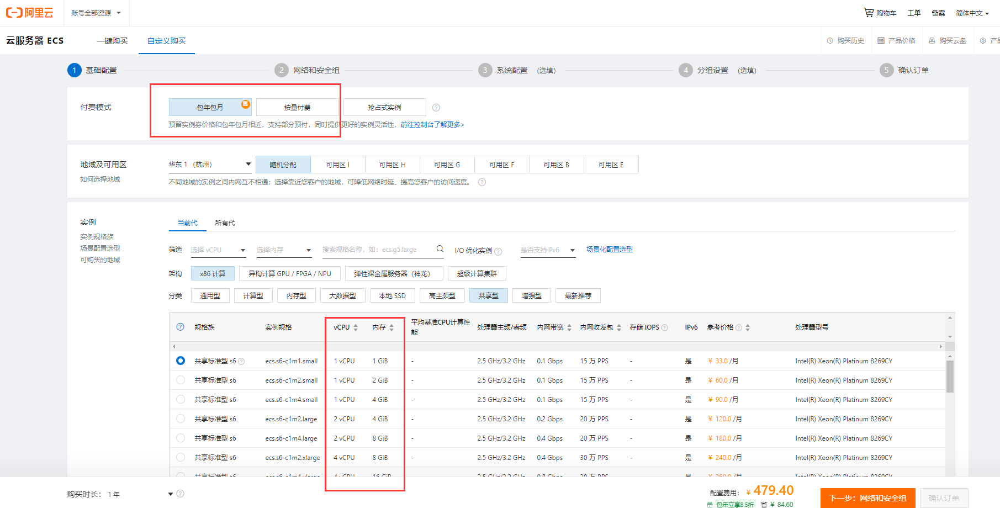

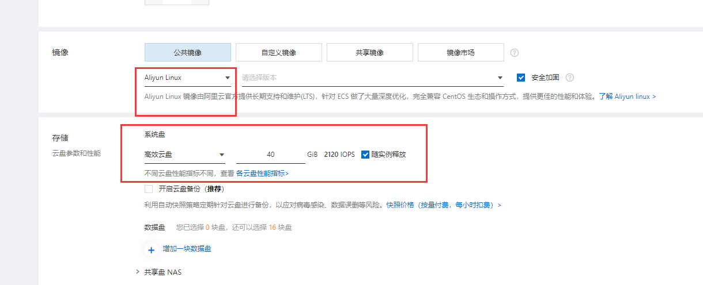

点击下一步，进入“网络与安全组”页面。关于带宽计费模式，随用随开型服主建议选择按使用流量付费，24小时开机型服主请自行斟酌。本页面其他内容可以保持默认。

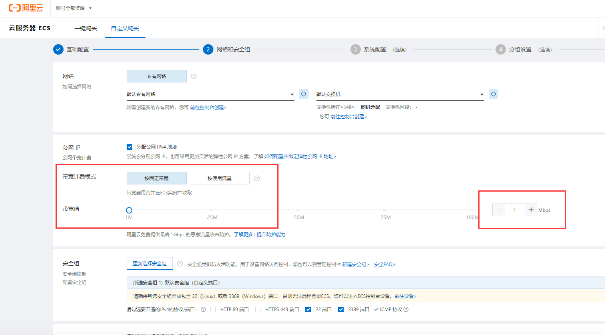

点击下一步，进入系统配置页面，选择登录凭证为自定义密码（密钥对我不会用QAQ，高手可以自便），设置root用户的登录密码，然后根据自己的需求完成其他的各项设置。**确认订单内容为自己的真实意思表达，并确认金额无误后，提交订单并支付。**

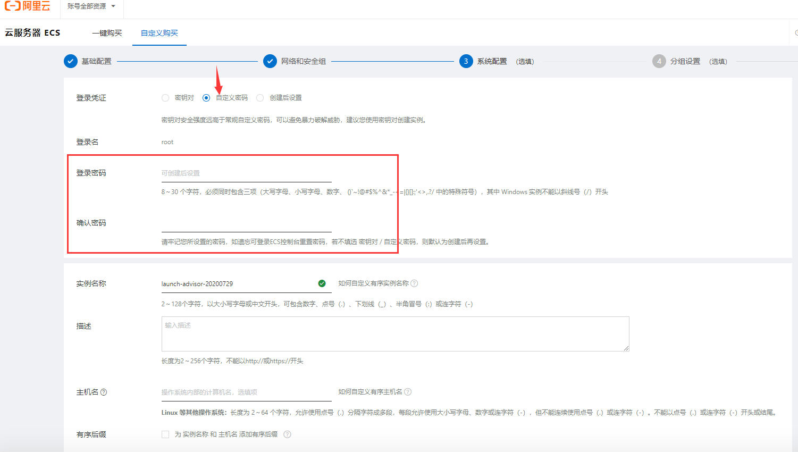

前往控制台（这里以阿里云ECS控制台为例），点击“网络与安全”、“安全组”，在列表中通过创建时间找到服务器对应的安全组，点击名称，在“入方向”中添加25565端口的TCP规则。


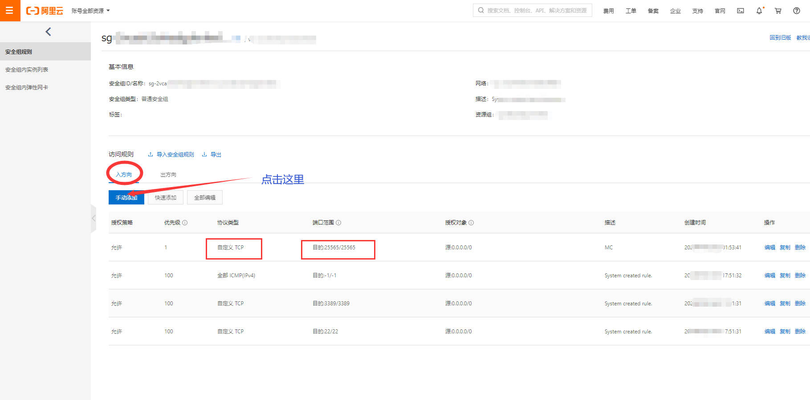

## 在服务器上安装java

- **首先确认服务器有没有预装java**

通过服务器管理页面给出的方法，远程连接服务器，在SSH命令窗口输入

```shell
java -version
```

如果出现java版本信息说明java已经安装，否则应先安装java。

- 通过yum安装服务端java

在SSH命令窗口输入以下命令，即可安装

```sh
yum -y install java-1.8.0-openjdk
```

- 通过上传安装包安装服务端java

如果使用上述方法无法安装java，请按照以下步骤操作。

前往[https://www.oracle.com/java/technologies/javase/javase-jdk8-downloads.html](https://www.oracle.com/java/technologies/javase/javase-jdk8-downloads.html)，下载64位的、后缀为`.tar.gz`的Linux版JDK，如图。（图片中版本仅供参考）

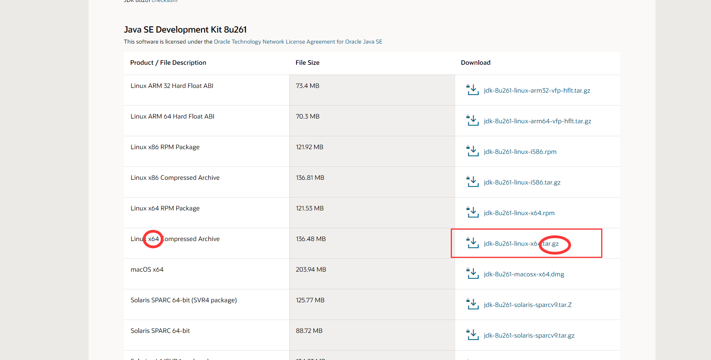

使用WinSCP登录到服务器，将其上传至`/usr/local`目录下。登录SSH命令窗口，输入以下命令，其中`xxx.tar.gz`需替换为实际的文件名。

```
tar -zxvf /usr/local/xxx.tar.gz
```

解压完成后，在WinSCP中将`/usr/local`目录下的`jdk1.8.0_261`文件夹（名称可能不同）改为`java`，这样做是为了方便配置环境变量，因此也可以不改。

用WinSCP打开`/etc`目录下的`profile`文件，右键点击编辑，在最后添加如下几行信息，保存

```shell
export JAVA_HOME=/usr/local/java
export PATH=$PATH:$JAVA_HOME/bin
export CLASSPATH=.:$JAVA_HOME/lib/dt.jar:$JAVA_HOME/lib/tools.jar
export JRE_HOME=$JAVA_HOME/jre
```

通过网页控制台或者命令重启服务器，在SSH命令窗口输入

```shell
java -version
```

来确认java是否正确安装

## 在服务器上安装、配置MC服务端

本步骤中上传文件、修改eula.txt文件等操作可以使用其他工具来等效完成，本文介绍相对简单的WinSCP。

在本地电脑上安装WinSCP并打开，第一次使用时，点击“新建站点”，文件协议保持默认的SFTP，站点名称处填写服务器的公网IP地址，密码填写本文上一段中所设置的登录密码。

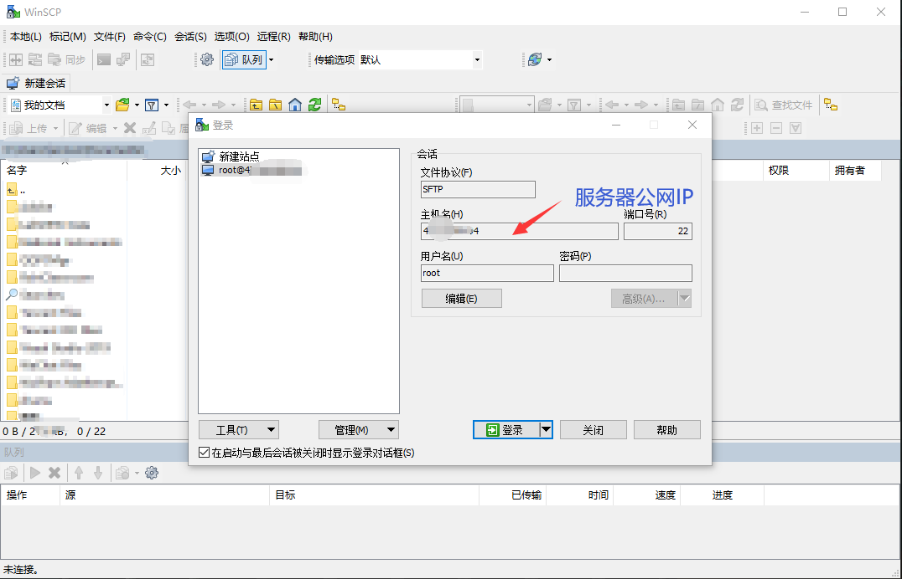

登录WinSCP，在`opt`目录中随便新建一个目录（比如MC1.16），将MC服务端程序`server.jar`上传至该目录下。

在SSH命令窗口输入以下命令来运行程序，其中“MC1.16”为自定义的目录名称，请根据实际命名修改。

```shell
cd opt/MC1.16
java -Xmx1024M -Xms1024M -jar server.jar nogui
```

第一次运行肯定会失败，并且会生成`eula.txt`文件，这是因为尚未签署用户协议。用WinSCP找到该文件，右键点击，选择“编辑”。将其中的`eula=false`更改为`eula=true`，点击保存。

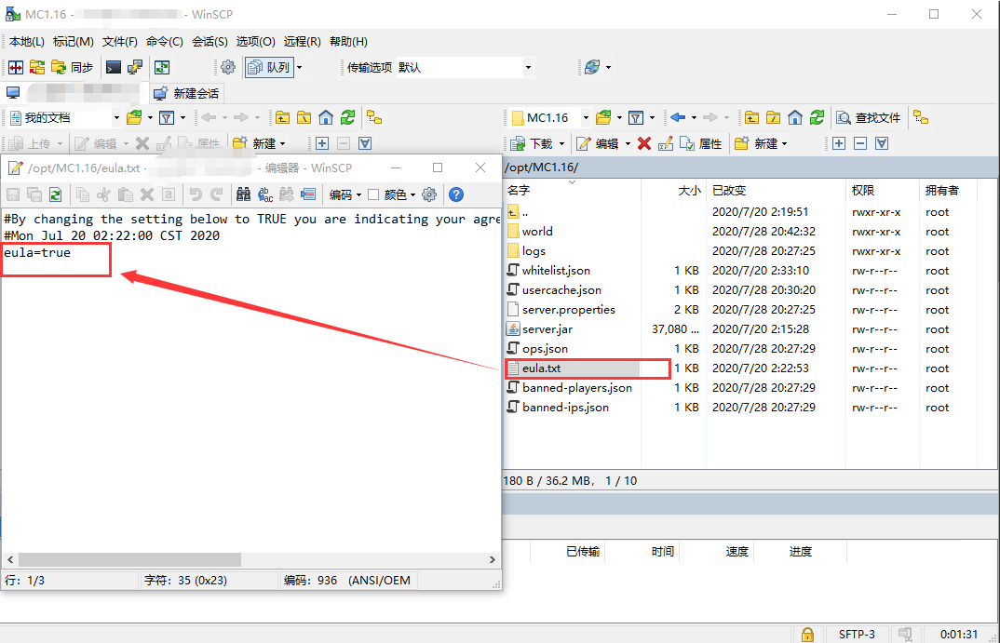

用WinSCP打开游戏规则配置文件`server.properties`，将`online-mode`后的`true`改为`false`来关闭正版帐号验证，否则无法进入游戏。之后可以根据个人需求对游戏规则进行修改。

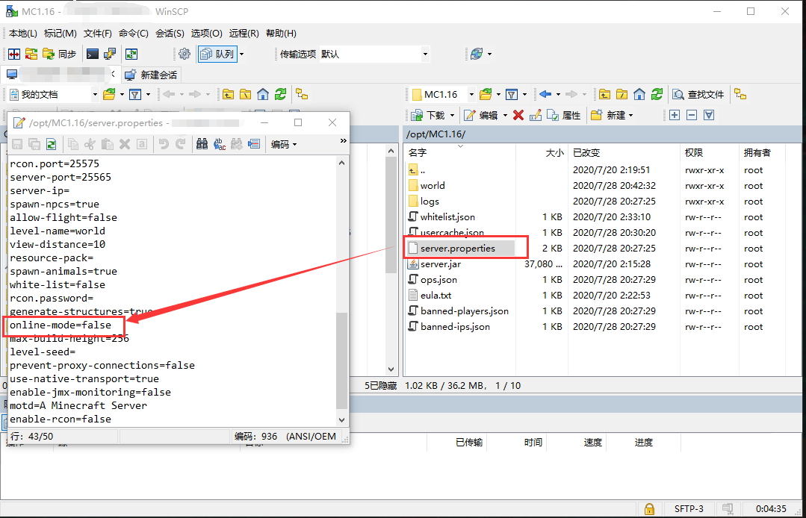

## 制作自动启动游戏的脚本

用WinSCP在根目录下新建`start_mc16.sh`文件（文件名可以自行设置，但不建议使用中文），右键点击编辑，将以下代码复制到文件中并保存。代码中的“MC1.16”为自定义的目录名称，请根据实际命名修改。这个脚本文件的作用是，自动打开服务端游戏程序，记录游戏日志，并保持后台运行。

```shell
#!/bin/bash
cd /opt/MC1.16
nohup java -Xmx1024M -Xms1024M -jar server.jar nogui >/root/MC1.16.log &
tail -f /root/MC1.16.log
```

要运行游戏，只需在SSH命令窗口输入

```shell
bash /start_mc16.sh
```

## 在本地电脑上安装HMCL，连接游戏服务器

将下载好的HMCL客户端放置在一个单独的文件夹里，双击运行。点击"版本列表"、“安装新游戏版本”。加载过程可能较慢，需要多刷新几次，等待列表加载完成后，选择1.16.1稳定版。

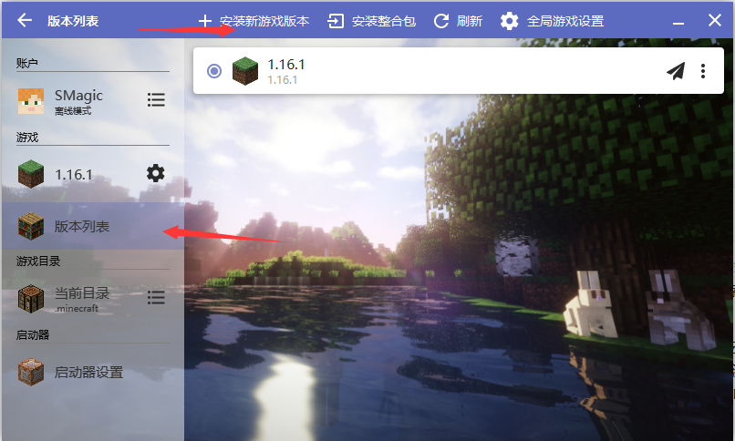

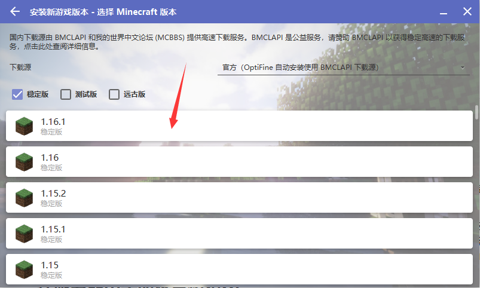

下载完成后，点击左上角返回，然后点击“启动游戏”，游戏启动后，点击“多人游戏”、“添加服务器”，输入服务器公网IP，即可连接服务端游戏。

## 在服务器中手动设置初始OP

在你第一次连接MC服务端的时候，你会发现没有人是OP，此时你需要手动修改文件来添加第一个OP。OP即多人游戏管理员，您可以搜索“我的世界 OP”了解更多信息。

在你进入过服务端游戏之后，用WinSCP登录服务器，在`/opt/MC1.16`目录下打开`user.json`文件，找到你想设置OP的玩家，将他的`name`字段和`uuid`字段复制到某处。接着打开`ops.json`文件，参考以下示例的格式设置该用户为OP。

`level`为OP等级，我暂时不知道它有什么用，姑且设置为4即可（我怀疑这个4是个magic number）。`bypassesPlayerLimit`为`true`时表示可以在服务器满员的情况下进入服务器，为`false`则不行。

```json
[
  {
    "uuid": "xxxxxxxx-xxxx-xxxx-xxxx-xxxxxxxxxxxx",
    "name": "SMagic",
    "level": 4,
    "bypassesPlayerLimit": true
  },
  {
    "uuid": "xxxxxxxx-xxxx-xxxx-xxxx-xxxxxxxxxxxx",
    "name": "Is666",
    "level": 4,
    "bypassesPlayerLimit": false
  }
]
```

## 在其他端口上开放游戏（非必需）

服务端游戏默认使用25565端口，如果您想在其他端口上开放游戏，需要在服务器控制台网页（例如阿里云控制台）设置端口，在服务器`/opt/MC1.16`目录下（“MC1.16为自定义目录名称”）修改`server.properties`文件中的端口，在本地游戏客户端“多人游戏”、“添加服务器”页面中在公网IP后添加英文冒号与端口号。相关操作方法前文已经出现，这里不再赘述。如果您对这些内容感到疑惑，请放心，这些操作不是必需的，忽略这些内容对游戏的运行没有影响。